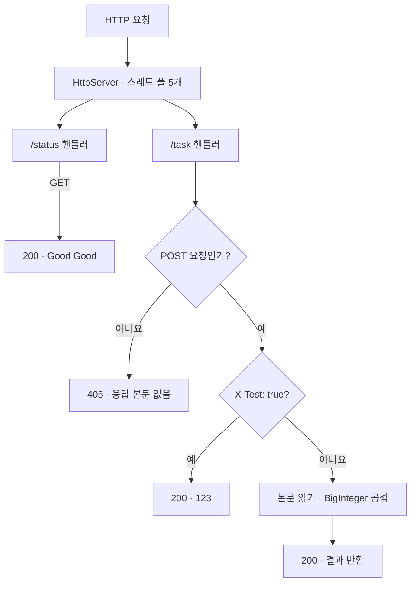

<div align="center">

# 🌐 Java HTTP Server

### 요청을 받고, 작업을 처리하고, 응답을 보내는 서버 구현

**JDK HttpServer · Request Handlers · BigInteger · Thread Pool**


Java의 내장 HTTP 서버 API로 요청 라우팅, 헤더 처리, 연산 및 응답 스트림을 학습합니다.

[프로젝트 소개](#-프로젝트-소개) · [API](#-api) · [실행 방법](#-실행-방법) · [요청 예제](#-요청-예제) · [기술 블로그](https://blog.naver.com/pathfinder7777/223741949807)

</div>

---

## 📘 프로젝트 소개

JDK의 `com.sun.net.httpserver.HttpServer`를 사용한 **Java HTTP 서버 학습 프로젝트**입니다. 상태 확인용 `/status`와 작업 처리용 `/task`를 등록하고, 각 요청을 핸들러 메서드에 연결합니다.

`/task`는 쉼표로 구분된 정수들을 받아 `BigInteger`로 곱한 결과를 반환합니다. 테스트 응답, 처리 시간 헤더, 고정 크기 스레드 풀을 통해 HTTP 통신과 서버 실행 구조를 살펴볼 수 있습니다.

> 현재 저장소에는 서버 코드가 구현되어 있습니다. 별도의 HTTP 클라이언트 프로그램과 여러 서버 사이의 작업 분산 기능은 포함되어 있지 않습니다.

## ✨ 주요 기능

| 기능 | 구현 내용 |
| --- | --- |
| **HTTP 서버** | 기본 포트 `8080`, 실행 인자로 포트 변경 |
| **요청 라우팅** | `/status`, `/task`에 각각 핸들러 연결 |
| **메서드 확인** | GET 상태 확인, POST 작업 처리 |
| **큰 정수 연산** | `BigInteger`를 이용한 정수 곱셈 |
| **테스트 모드** | `X-Test: true`이면 연산 대신 고정 응답 |
| **디버그 모드** | `X-Debug: true`이면 처리 시간 헤더 추가 |
| **동시 요청 처리** | 고정 크기 5개 스레드 풀 사용 |
| **응답 전송** | HTTP 상태 코드, 바이트 길이, 응답 스트림 처리 |

## 🔀 요청 처리 구조



일반 작업 요청에 `X-Debug: true`가 있으면 `X-Debug-Info` 응답 헤더를 추가합니다. 테스트 모드는 디버그 처리보다 먼저 반환하므로 두 헤더를 함께 보내도 테스트 응답만 수행합니다.

## 📡 API

| 경로 | 메서드 | 입력 | 정상 응답 |
| --- | --- | --- | --- |
| `/status` | `GET` | 본문 없음 | `200`, 본문 `Good Good` |
| `/task` | `POST` | 쉼표로 구분한 정수 문자열 | `200`, 곱셈 결과를 포함한 문자열 |
| `/task` + `X-Test: true` | `POST` | 본문 생략 가능 | `200`, 본문 `123` 및 줄바꿈 |

### 작업 요청 형식

```text
2,3,4
```

위 입력의 계산 결과는 **24**입니다. 본문은 JSON이 아닌 일반 문자열이며, 실제 응답에는 코드에 정의된 접두 문구와 줄바꿈이 포함됩니다.

- 음수와 큰 정수도 `BigInteger`로 처리합니다.
- 전체 본문의 앞뒤 공백은 제거합니다.
- 각 숫자별 공백은 제거하지 않으므로 `2, 3, 4` 대신 **`2,3,4`** 형태로 보냅니다.

### 요청 헤더

| 헤더 | 값 | 동작 |
| --- | --- | --- |
| `X-Test` | `true` | 입력 연산을 생략하고 `123` 반환 |
| `X-Debug` | `true` | `X-Debug-Info` 응답 헤더에 측정 시간 추가 |

디버그 시간은 `System.nanoTime()`으로 **요청 본문 읽기와 계산 구간**을 측정합니다. 응답 전송이나 클라이언트 왕복 시간을 측정하는 값은 아닙니다.

## 🚀 실행 방법

### 1. 준비 및 저장소 내려받기

JDK 17과 Maven을 준비합니다. Maven이 없다면 저장소에 포함된 Maven Wrapper를 사용할 수 있습니다.

```powershell
git clone https://github.com/path0971/HTTP.git
cd HTTP
```

### 2. 빌드

Maven을 설치한 경우:

```powershell
mvn clean package
```

Windows에서 Maven Wrapper를 사용하는 경우:

```powershell
.\mvnw.cmd clean package
```

### 3. 서버 실행

```powershell
java -jar target/httpserver-1.0-SNAPSHOT.jar
```

다른 포트를 사용하려면 인자로 전달합니다.

```powershell
java -jar target/httpserver-1.0-SNAPSHOT.jar 9090
```

서버 터미널은 실행 상태로 유지하고, 요청은 별도 터미널에서 보냅니다. 종료할 때는 `Ctrl + C`를 누릅니다.

> POM에는 JavaFX 설정도 남아 있지만 HTTP 서버의 진입점은 `com.pathfinder.httpserver.WebServer`입니다. JavaFX 플러그인이 참조하는 `HelloApplication`은 저장소에 없으므로 위 JAR 실행 경로를 사용합니다.

## 🧪 요청 예제

아래는 기본 포트 `8080`을 사용하는 **PowerShell용 예제**입니다. `curl` 별칭과의 혼동을 피하도록 `curl.exe`를 사용합니다.

### 상태 확인

```powershell
curl.exe -i http://localhost:8080/status
```

예상 결과: HTTP `200`, 본문 `Good Good`.

### 정수 곱셈

```powershell
curl.exe -i -X POST http://localhost:8080/task -H "Content-Type: text/plain" --data "2,3,4"
```

예상 결과: HTTP `200`, 본문에 계산 결과 `24` 포함.

### 테스트 응답

```powershell
curl.exe -i -X POST http://localhost:8080/task -H "X-Test: true"
```

예상 결과: HTTP `200`, 본문 `123`.

### 처리 시간 확인

```powershell
curl.exe -i -X POST http://localhost:8080/task -H "X-Debug: true" --data "100,200,300"
```

예상 결과: 본문에 `6000000` 포함, 응답 헤더에 `X-Debug-Info` 추가.

### 허용하지 않는 메서드 확인

```powershell
curl.exe -i http://localhost:8080/task
```

예상 결과: HTTP `405`, 응답 본문 없음. 위 결과는 소스 기준 예상 동작이며 이 문서 작성 과정에서 서버를 실행해 실측한 결과는 아닙니다.

## 🗂️ 코드 구성

| 파일 | 역할 |
| --- | --- |
| [`WebServer.java`](src/main/java/com/pathfinder/httpserver/WebServer.java) | 서버 실행, 핸들러, 연산, 응답 전송 |
| [`pom.xml`](pom.xml) | Java 17 빌드 및 JAR 진입점 설정 |
| [`mvnw`](mvnw), [`mvnw.cmd`](mvnw.cmd) | Maven Wrapper 실행 스크립트 |
| [`hello-view.fxml`](src/main/resources/com/pathfinder/httpserver/hello-view.fxml) | 남아 있는 JavaFX 화면 리소스; HTTP 처리에는 사용하지 않음 |

### 주요 메서드

| 메서드 | 책임 |
| --- | --- |
| `main()` | 포트 결정 및 서버 시작 |
| `startServer()` | HttpServer 생성, Context·Handler 등록, Executor 설정 |
| `handleStatusCheckRequest()` | GET 상태 확인 요청 처리 |
| `handleTaskRequest()` | POST 검증, 테스트·디버그 헤더 처리, 연산 호출 |
| `calculateResponse()` | 본문 파싱 및 `BigInteger` 곱셈 |
| `sendResponse()` | `200` 헤더 전송 및 응답 스트림 쓰기·종료 |

## 📝 현재 구현 범위

- `/task`의 비POST 요청은 `405`를 반환하지만, `/status`의 비GET 요청은 상태 코드를 명시하지 않고 연결을 닫습니다.
- 잘못된 숫자나 빈 본문에 대한 구조화된 `400` 응답은 구현되어 있지 않습니다.
- HTTP Context는 접두 경로 매칭을 사용하며, 핸들러에 정확한 경로 일치 검증은 없습니다.
- 요청 본문을 `readAllBytes()`로 읽으며 별도 크기 제한은 없습니다.
- 응답의 `Content-Type`과 문자 인코딩은 명시적으로 지정하지 않습니다.
- POM에 JUnit 의존성은 있지만 테스트 소스는 포함되어 있지 않습니다.

## 🌱 확장 방향

- [ ] 별도의 Java HTTP 클라이언트 구현
- [ ] 숫자별 공백 처리와 잘못된 입력 검증
- [ ] 일관된 `400`·`405` 응답과 `Allow` 헤더
- [ ] 응답 문구 정리 및 JSON 응답 형식
- [ ] 요청 크기 제한과 과부하 처리
- [ ] 서버 및 Executor의 정상 종료 처리
- [ ] API 자동화 테스트

## 📚 개발 기록

HTTP 서버 구현과 관련된 설명은 기술 블로그에서 확인할 수 있습니다.

**[Java HTTP 서버 개발 기록 읽기 →](https://blog.naver.com/pathfinder7777/223741949807)**

---

<div align="center">

**Java HTTP Server**<br>
요청 라우팅부터 응답 스트림까지, 코드로 이해하는 HTTP 통신

</div>
